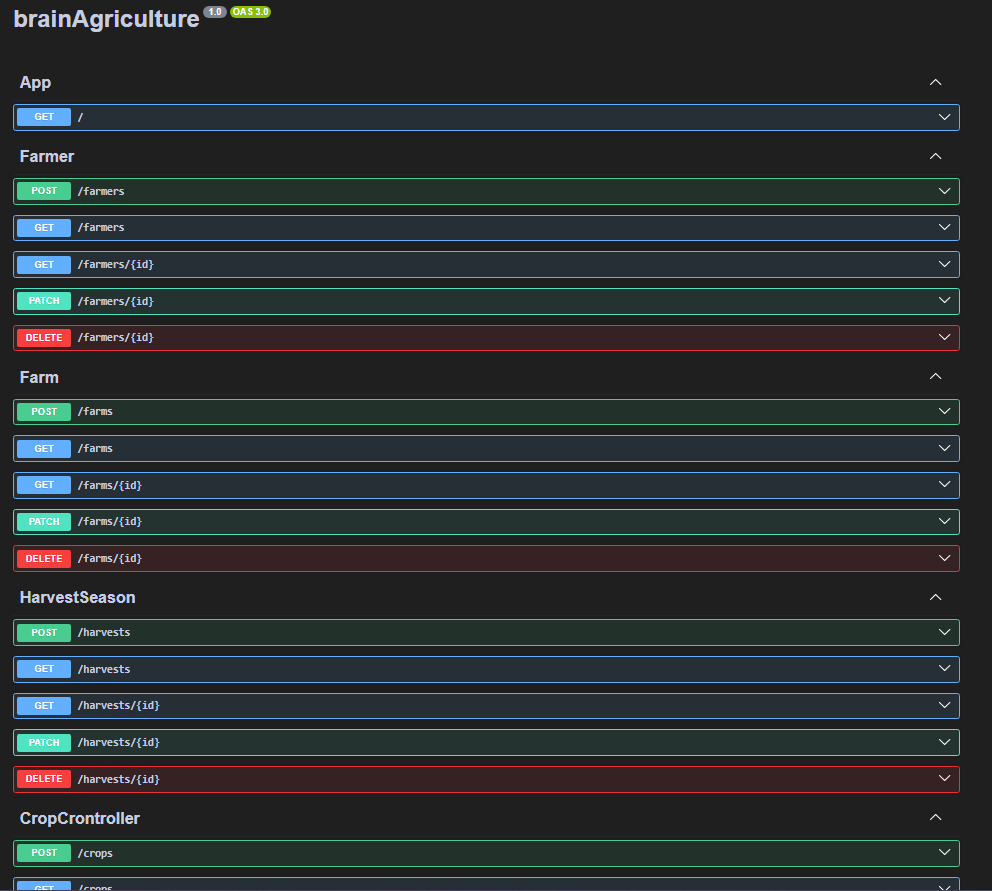
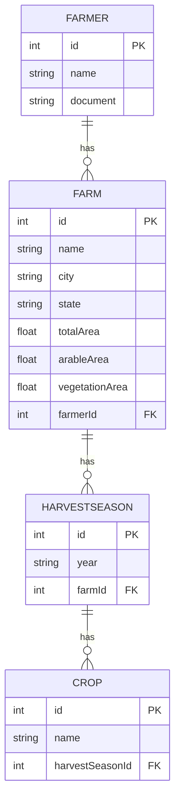

# Brain Agriculture

Este é um projeto backend desenvolvido com NestJS para gerenciamento de produtores rurais e suas propriedades.

## 💻 Tecnologias

- [Node.js](https://nodejs.org/)
- [NestJS](https://nestjs.com/)
- [PostgreSQL](https://www.postgresql.org/)
- [Prisma ORM](https://www.prisma.io/)
- [Docker](https://www.docker.com/)
- [TypeScript](https://www.typescriptlang.org/)

## 🚀 Como executar o projeto

### Pré-requisitos

Antes de começar, você vai precisar ter instalado em sua máquina as seguintes ferramentas:
- [Node.js](https://nodejs.org/)
- [Docker](https://www.docker.com/)
- [Docker Compose](https://docs.docker.com/compose/)

### 🎲 Rodando a aplicação

1. Clone o repositório
```bash
git clone https://github.com/krDannylo/brainAgriculture.git
```

2. Instale as dependências
```bash
npm install
```

3. Configure as variáveis de ambiente
- Crie um arquivo `.env.docker` na raiz do projeto com as seguintes variáveis:
```env
DB_USER=seu_usuario
DB_PASSWORD=sua_senha
DB_NAME=brain_agriculture
DATABASE_URL="postgresql://seu_usuario:sua_senha@db:5432/brain_agriculture?schema=public"
```

4. Inicie os containers com Docker Compose
```bash
docker-compose up -d
```

A aplicação estará disponível em `http://localhost:3001`

### 🔥 Rodando em desenvolvimento

Se preferir rodar em ambiente de desenvolvimento:

1. Configure um arquivo `.env` com as variáveis de ambiente necessárias
2. Execute os comandos:

```bash
# Rodar as migrações do banco de dados
npx prisma migrate deploy

# Iniciar em modo de desenvolvimento
npm run start:dev
```

A aplicação estará disponível de forma padrão em `http://localhost:3000`

## 📝 Scripts disponíveis

- `npm run build`: Compila o projeto
- `npm run start`: Inicia o projeto em modo de produção
- `npm run start:dev`: Inicia o projeto em modo de desenvolvimento com hot-reload
- `npm run test`: Executa os testes unitários

## 📦 Estrutura do Projeto

O projeto contém a seguinte estrutura e diretórios principais:

- `src/`: Código fonte da aplicação
- `prisma/`: Schemas e migrações do banco de dados
- `test/`: Arquivos de teste
- `dist/`: Código compilado (gerado após build)

## 🛠 Documentação da API

A documentação da API está disponível através do Swagger UI em:
```
/docs
```



### 🤔 Qual a ideia e como as rotas funcionam?

Seu projeto será iniciado com **0 dados no banco de dados**, então vamos começar a popular e demonstrar como o desenvolvimento deste desafio foi pensado.

Lembrando que os dados abaixo são fictícios, podendo ter leves alterações:

---

## 1️⃣ Criar um Produtor

**Rota:** `POST /farmers`

**Body de exemplo:**

```json
{
  "name": "Farmer Productor",
  "document": "672.996.930-03"
}
```

**Retorno:**

```json
{
  "id": 2,
  "name": "Farmer Productor",
  "document": "672.996.930-03",
  "createdAt": "2025-06-09T17:33:10.286Z",
  "updatedAt": "2025-06-09T17:33:10.286Z"
}
```

---

## 2️⃣ Criar uma Propriedade Rural

**Rota:** `POST /farms`

**Body de exemplo:**

```json
{
  "name": "Farm Property",
  "city": "São Paulo",
  "state": "SP",
  "totalArea": 4,
  "arableArea": 3,
  "vegetationArea": 1
}
```

**Retorno:**

```json
{
  "id": 1,
  "name": "Farm Property",
  "city": "São Paulo",
  "state": "SP",
  "totalArea": 4,
  "arableArea": 3,
  "vegetationArea": 1,
  "farmerId": null,
  "createdAt": "2025-06-09T17:28:06.226Z",
  "updatedAt": "2025-06-09T17:28:06.226Z"
}
```

---

## 3️⃣ Vincular a Propriedade ao Agricultor

**Rota:** `PATCH /farms/1`

**Body de exemplo:**

```json
{
  "farmerId": 2
}
```

**Retorno:**

```json
{
  "id": 1,
  "name": "Farm Property",
  "city": "São Paulo",
  "state": "SP",
  "totalArea": 4,
  "arableArea": 3,
  "vegetationArea": 1,
  "farmerId": 2,
  "createdAt": "2025-06-09T17:28:06.226Z",
  "updatedAt": "2025-06-09T17:38:14.096Z"
}
```

---

## 4️⃣ Criar uma Safra

**Rota:** `POST /harvests`

**Body de exemplo:**

```json
{
  "year": "2023",
  "farmId": 1
}
```

**Retorno:**

```json
{
  "id": 1,
  "year": "2023",
  "farmId": 1,
  "createdAt": "2025-06-09T17:39:27.484Z",
  "updatedAt": "2025-06-09T17:39:27.484Z"
}
```

---

## 5️⃣ Criar uma Cultura

**Rota:** `POST /crops`

**Body de exemplo:**

```json
{
  "name": "Soja",
  "harvestSeasonId": 1
}
```

**Retorno:**

```json
{
  "id": 1,
  "name": "Soja",
  "harvestSeasonId": 1,
  "createdAt": "2025-06-09T17:29:04.736Z",
  "updatedAt": "2025-06-09T17:29:04.736Z"
}
```

---

## Consultar os Dados do Agricultor com Todas as Relações

**Rota:** `GET /farmers`

**Retorno esperado:**

```json
[
  {
    "id": 1,
    "name": "Farmer Productor",
    "document": "672.996.930-03",
    "createdAt": "2025-06-09T05:22:50.981Z",
    "updatedAt": "2025-06-09T05:23:41.976Z",
    "Farm": [
      {
        "id": 1,
        "name": "Farm Property",
        "city": "São Paulo",
        "state": "SP",
        "totalArea": "4",
        "arableArea": "3",
        "vegetationArea": "1",
        "farmerId": 1,
        "createdAt": "2025-06-09T17:28:06.226Z",
        "updatedAt": "2025-06-09T17:28:24.911Z",
        "HarvestSeason": [
          {
            "id": 1,
            "year": "2023",
            "farmId": 1,
            "createdAt": "2025-06-09T17:28:56.231Z",
            "updatedAt": "2025-06-09T17:28:56.231Z",
            "Crop": [
              {
                "id": 1,
                "name": "Soja",
                "harvestSeasonId": 1,
                "createdAt": "2025-06-09T17:29:04.736Z",
                "updatedAt": "2025-06-09T17:29:04.736Z"
              }
            ]
          }
        ]
      }
    ]
  }
]
```
### Por fim temos rota de Dashboard e Docs (Swagger)

**Rota:** `GET /dashboard`

**Retorno:**

```json
{
  "totalFarms": 1,
  "totalHectares": "4",
  "farmsByState": [
    {
      "_count": 1,
      "state": "SP"
    }
  ],
  "cropsByCulture": [
    {
      "_count": 1,
      "name": "Soja"
    }
  ],
  "landUsage": {
    "arable": "3",
    "vegetation": "1"
  }
}
```

**Rota:** `GET /docs`
#### Para consultar o SWAGGER
---
## 🤝 Diagrama de Entidade Relacionamento

Abaixo está a modelagem de dados utilizada neste projeto, representando as entidades principais e seus relacionamentos.

### 🧱 Entidades e Atributos

- **FARMER**
  - `id` (PK): Identificador do agricultor
  - `name`: Nome do agricultor
  - `document`: Documento (CPF/CNPJ)

- **FARM**
  - `id` (PK): Identificador da fazenda
  - `name`: Nome da fazenda
  - `city`: Cidade onde está localizada
  - `state`: Estado
  - `totalArea`: Área total da fazenda
  - `arableArea`: Área agricultável
  - `vegetationArea`: Área de vegetação
  - `farmerId` (FK): Referência ao agricultor (FARMER)

- **HARVESTSEASON**
  - `id` (PK): Identificador da safra
  - `year`: Ano da safra
  - `farmId` (FK): Referência à fazenda (FARM)

- **CROP**
  - `id` (PK): Identificador da cultura
  - `name`: Nome da cultura
  - `harvestSeasonId` (FK): Referência à safra (HARVESTSEASON)




Com isso, temos uma cadeia de relacionamentos funcionando:

- `Farmer` possui uma ou mais `Farm(s)`
- Cada `Farm` possui `HarvestSeason(s)`
- Cada `HarvestSeason` possui `Crop(s)`


## 📊 Melhorias

  - Definir e ajustar o campo document do Farmer se será salvo com pontuação.

  - Adicionar camadas de Usuário, A ideia aqui é criar um módulo de usuários que é quem de fato conduzirá o sistema, utilizando JWT, separação de role (admin, basic).

  - Corrigir horário do CreatedAt do banco de dados, está 3 Horas na frente.

  - Adicionar rotas complementares para encurtar a quantidade de operações entre rotas.

  - Adicionar limit e offset nas rotas de findAll

  - Adicionar Interceptor para verificar valores em body (otimização)

  - Adicionar Interceptor para logger

  - ...